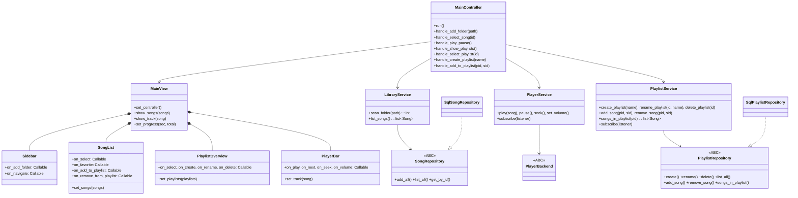

# Architecture — Wave Music Player

> Cross-reference: [PRD](PRD.md) · [Schema](schema.md)

## 1. Arsitektur saat ini (hasil audit)

Niatnya MVC, praktiknya **View-heavy + Fat Controller + Model ganda**:

```txt
main.py → View(ctk.CTk) ──creates──▶ Sidebar / MainContent / PlayerBar / SplashScreen
        → MainController(engine, view)  ← View.set_controller()
              └── add_music_from_folder(): listdir + TinyTag + mapping + dedup + commit (semua di 1 method)
models/schema.py + models/database.py   ← model asli (bagus)
model.py (CounterModel — template mati, tidak dipakai)
```

Masalah utama (dengan lokasi):

1. **Konstruktor ber-side-effect:** `controller.py:22` menjalankan `view.mainloop()` di `__init__` → tidak testable.
2. **Coupling sirkular:** `Sidebar.py:52` memanggil `self.master.controller.add_music_from_folder()` langsung. Batalkan dialog (`""`) → `os.listdir("")` crash. Tambah lagu → UI tidak refresh (tanpa event).
3. **View salah tanggung jawab (sebagian diperbaiki Fase 0–1):** `init_db()` sudah pindah ke `main.py` (splash hanya visual); `refresh_song_list()` tinggal sebagai shim deprecated ke `show_songs()`; `change_main_content()` masih memakai pola `destroy()` + bikin frame baru (hapus di Fase 4).
4. **Component mati:** `MainContent` 9 lagu dummy tanpa callback; `PlayerBar` tombol/slider tanpa command + `btn_volume` didefinisikan 2x (baris 70 & 76); belum ada library audio di `pyproject.toml`.
5. **Config rapuh:** `config.py:12-15` `icons.load()` saat import; `models/database.py:4` path DB relatif CWD + engine global + `check_same_thread=False`.
6. **Filter sempit:** cuma `.flac`, non-rekursif (`os.listdir`), blocking UI.

## 2. Arsitektur target (berlapis, dependency satu arah)

```txt
views --callback--> controllers --call--> services --call--> domain/interfaces
  <--update--         <--event--              ▲ infrastructure implements interfaces
```

Target folder (migrasi bertahap, UI belakangan — sesuai PRD Fase 0):

> Status Fase 0 ✅: `domain/`, `infrastructure/{db,models,song_repository,audio_tagger}.py`,
> `services/library_service.py`, `app/container.py`, `controllers/main_controller.py`,
> `views/theme.py`, `utils/icons.py` sudah ada. `models/` dan `controller.py` tinggal
> sebagai shim re-export; `model.py` dihapus. `views/` baru berisi `theme.py` —
> `main_view/sidebar/song_list/player_bar` dijadwalkan Fase 1–2. Aturan gaya di
> [Style Guide](style-guide.md).
>
> Status Fase 3 ✅: `Playlist` entity + `PlaylistRepository` ABC +
> `infrastructure/playlist_repository.py` + `services/playlist_service.py`
> (`playlist_changed` event) sudah ada; `MainController` memegang
> `current_view` (library/playlists/playlist-detail) dan antrean mengikuti
> view aktif; `components/PlaylistOverview.py` + `components/dialogs.py`
> untuk overview/chooser; `MainContent` punya tombol `+`/`×` per baris.

```txt
main.py               # bootstrap + init_db + controller.bind + startup load
config.py             # re-export theme (kompat); nilai kanonis di views/theme.py
app/container.py      # wiring: engine → repo → service → view → controller
domain/entities.py    # Song, Playlist (dataclass, tanpa SQLModel/Tk)
domain/interfaces.py  # SongRepository, PlaylistRepository, PlayerBackend ABC + EventBus
infrastructure/db.py          # engine + init_db + session factory (path absolut)
infrastructure/models.py      # SQLModel kanonis — lihat schema.md
infrastructure/song_repository.py      # SongRepository via SQLModel
infrastructure/playlist_repository.py  # PlaylistRepository via SQLModel (Fase 3)
infrastructure/audio_tagger.py         # bungkus TinyTag: path → SongDraft
infrastructure/player_vlc.py           # PlayerBackend via python-vlc (Fase 2)
infrastructure/player_miniaudio.py     # PlayerBackend fallback (Fase 2)
infrastructure/probe.py                # probe subprocess anti-abort C (Fase 2)
services/library_service.py   # scan_folder(), list_songs(), toggle_favorite()
services/player_service.py    # queue + transport + auto-next wrap (Fase 2)
services/playlist_service.py  # CRUD playlist + link, event playlist_changed (Fase 3)
controllers/main_controller.py# tipis: handle_* + current_view + ticker after(1000)
components/Sidebar.py + MainContent.py + PlayerBar.py + PlaylistOverview.py + dialogs.py
views/theme.py        # design system (lihat Style Guide)
utils/icons.py        # cached icon loader
```

Aturan:

- `views` **tidak boleh** import controller/service/repo. Hanya expose `on_add_folder`, `on_select`, `on_play`, … bertipe `Callable`.
- `controllers` pegang `service + view`, **bukan** `Engine`.
- `services` pegang `interface`, bukan SQLModel langsung → bisa di-test dengan repo fake.
- `infrastructure` satu-satunya layer yang tahu SQLModel/VLC/TinyTag.

## 3. Hubungan antar class



Wiring di `app/container.py` (pseudocode):

```python
engine = create_engine(abs_db_url)
repo = SqlSongRepository(engine)
library = LibraryService(repo, tagger=AudioTagger())
player = PlayerService(backend=VlcBackend())
view = MainView()                       # tanpa init_db di dalamnya
controller = MainController(view, library, player)
view.bind(on_add_folder=controller.handle_add_folder, ...)
controller.run()
```

## 4. Alur use-case

- **Add (PRD F1):** `Sidebar --on_add_folder--> Controller.handle_add_folder --scan (thread)--> LibraryService --publish library_changed--> EventBus --show_songs--> SongList`. Menggantikan `destroy()`-recreate.
- **List (PRD F2):** `Controller.handle_show_music --list_songs--> LibraryService --list_all--> Repo --> SongList.set_songs()`. Sumber kebenaran = tabel `song` di [Schema §2](schema.md#2-tabel).
- **Play (PRD F3):** `SongList --on_select(id)--> Controller --songs--> Service --play_queue--> PlayerService --load/play--> PlayerBackend --set_track/set_progress--> PlayerBar`. Songs = `library.list_songs` atau `playlists.songs_in_playlist` sesuai view aktif. Posisi slider via `after(1000)`, event `media_end` → auto-next dengan wrap ke lagu pertama.

Aturan threading: TinyTag + VLC callback **tidak boleh** menyentuh widget langsung; selalu lewat `view.after(0, ...)` atau EventBus.

## 5. Backend audio: python-vlc vs alternatif

Jawaban atas pertanyaan: **ya, `python-vlc` pilihan yang tepat sebagai primer — tapi jangan di-hardcode, bungkus di balik `PlayerBackend` ABC + sediakan fallback tanpa dependensi sistem.**

| Kriteria                           | python-vlc ✅ primer                                           | pygame.mixer (dipakai `__old/`)     | just_playback / miniaudio (fallback)          |
| ---------------------------------- | -------------------------------------------------------------- | ----------------------------------- | --------------------------------------------- |
| FLAC + MP3 + OGG + M4A             | Ya, penuh                                                      | FLAC/seek lemah, `get_pos` kasar    | Ya (miniaudio native)                         |
| Seek akurat + durasi + event habis | Ya (`set_time`, `MediaPlayerEndReached`)                       | Tidak andal                         | Ya, cukup                                     |
| Install                            | `pip install python-vlc` **+ VLC desktop terinstall** (libvlc) | `pip` saja                          | `pip` saja                                    |
| Risiko                             | Path libvlc di Windows/Linux; user tanpa VLC = bisu            | Cocok untuk prototype, mentok di F3 | Fitur (queue, equalizer) lebih tipis dari VLC |
| Kecocokan                          | Kebutuhan PRD F3 (seek ±1 dtk, auto-next)                      | Nostalgia `__old/`, tidak cukup     | Cadangan saat VLC absen                       |

Rekomendasi konkret:

1. ✅ SELESAI — `domain/interfaces.py::PlayerBackend` (`load/play/pause/seek/set_volume/get_pos/on_end`) + `BackendUnavailableError`.
2. ✅ SELESAI — `infrastructure/player_vlc.py` (primer) + `infrastructure/player_miniaudio.py` (fallback). `create_player_backend()` di `app/container.py`: VLC bila libvlc ada, miniaudio bila tidak + log warning + banner di UI ("VLC tidak ditemukan, mode kompatibilitas"). Override paksa via `WAVE_AUDIO_BACKEND=vlc|miniaudio`.
3. ✅ SELESAI — `pyproject.toml`: `python-vlc` + `miniaudio` via `uv add`. `pygame` tidak dibawa ke versi baru.
4. ✅ SELESAI — `PlayerService` hanya tahu ABC → ganti backend tanpa ubah UI/controller.

Catatan kompatibilitas (terverifikasi): libvlc 4 menghapus event-manager API, media parsing, dan `media_player_stop`, plus mengubah ABI `media_new` (path benar tiba sebagai MRL sampah — terlihat di smoke test). Karena itu probe `is_available()` hanya menerima libvlc mayor 3; versi lain jatuh ke miniaudio. `VlcBackend` memakai event bila ada, selebihnya polling-monitor + pause/rewind sebagai stop; durasi yang gagal dibaca VLC ditutup fallback metadata lagu. `python-vlc` vs snapshot libvlc 4.0-dev bisa abort di level C (tidak tertangkap `try`, bahkan non-deterministik antar proses); karena itu kedua probe berjalan sebagai subprocess — abort menjadi exit code non-nol dan factory jatuh ke miniaudio. Bila VLC crash di mesinmu, paksa fallback via `WAVE_AUDIO_BACKEND=miniaudio`.

## 6. Langkah migrasi (tidak merusak yang jalan)

1. ✅ SELESAI — Tambah `domain/`, `infrastructure/song_repository.py`, `services/library_service.py`, `app/container.py`; `mainloop` pindah ke `run()`; `model.py` dihapus. Plus: `views/theme.py` (design system) + `utils/icons.py` (cached loader).
2. ✅ SELESAI — `init_db` dipanggil di `main.py`; DB path absolut (`data/app.db`, di-`gitignore`); `utils/icons` cached (lazy penuh saat refactor views).
3. ⚠️ SEBAGIAN — `master.controller` diganti callback (`Sidebar.on_add_folder/on_navigate`, `MainContent.on_select/on_favorite`, `PlayerBar.on_*`); `set_songs()` selesai. `PlayerBar` sudah ter-wiring ke `PlayerService` (Fase 2); playlist overview selesai (Fase 3).
4. Hapus pola `destroy()`-recreate; ganti dengan update data + EventBus.
