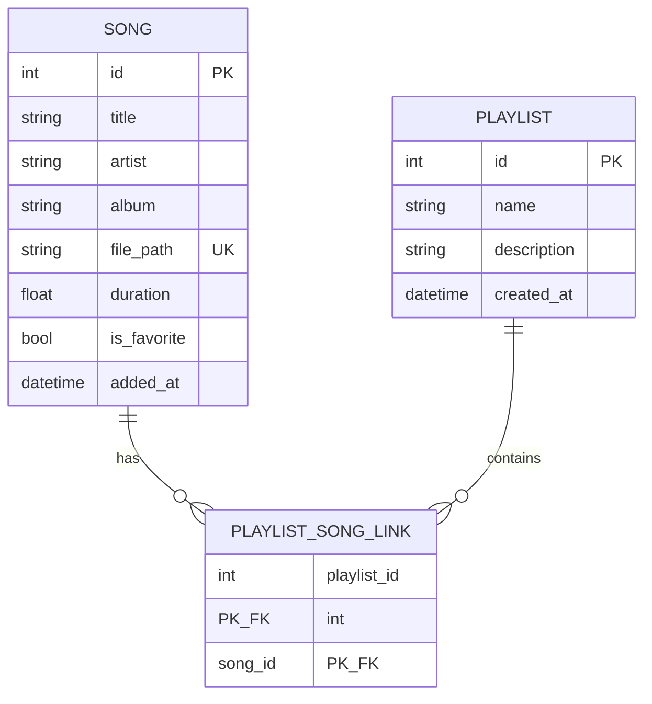

# Schema — Wave Music Player

> Cross-reference: [PRD](PRD.md) · [Architecture](architecture.md)

Sumber kebenaran saat ini: `models/schema.py` + `models/database.py`. Target pindahan: `infrastructure/models.py` + `infrastructure/db.py` (lihat [Architecture §2](architecture.md#2-arsitektur-target-berlapis-dependency-satu-arah)). Struktur tabel **tidak berubah**, yang berubah hanya lokasi + cara akses (via Repository, bukan Engine langsung).

## 1. ER diagram

## 2. Tabel

### `song`

| Kolom         | Tipe     | Constraint                           | Keterangan                                                                     |
| ------------- | -------- | ------------------------------------ | ------------------------------------------------------------------------------ |
| `id`          | INTEGER  | PK autoincrement                     | —                                                                              |
| `title`       | TEXT     | NOT NULL, INDEX                      | Fallback = nama file (diisi `audio_tagger`)                                    |
| `artist`      | TEXT     | NOT NULL, default `"Unknown Artist"` | Dari TinyTag                                                                   |
| `album`       | TEXT     | NOT NULL, default `"Unknown Album"`  | Dari TinyTag                                                                   |
| `file_path`   | TEXT     | UNIQUE, INDEX, NOT NULL              | **Identitas dedup.** Path absolut ternormalisasi                               |
| `duration`    | REAL     | NOT NULL, default `0.0`              | Detik (float). Catatan: controller lama cast ke `int` — hentikan, simpan float |
| `is_favorite` | BOOLEAN  | NOT NULL, default `false`            | PRD F2/F4: favorite = flag, bukan tabel                                        |
| `added_at`    | DATETIME | NOT NULL, default `now`              | Untuk sort "Recently Added". Ganti ke UTC saat refactor                        |

### `playlist`

| Kolom         | Tipe     | Constraint              | Keterangan                   |
| ------------- | -------- | ----------------------- | ---------------------------- |
| `id`          | INTEGER  | PK autoincrement        | —                            |
| `name`        | TEXT     | NOT NULL                | PRD F4 ✅ selesai Fase 3     |
| `description` | TEXT     | NULL                    | —                            |
| `created_at`  | DATETIME | NOT NULL, default `now` | UTC saat refactor            |

### `playlistsonglink` (many-to-many)

| Kolom         | Tipe    | Constraint                                 |
| ------------- | ------- | ------------------------------------------ |
| `playlist_id` | INTEGER | PK, FK → `playlist.id` (CASCADE on delete) |
| `song_id`     | INTEGER | PK, FK → `song.id` (CASCADE on delete)     |

Composite PK `(playlist_id, song_id)` mencegah lagu ganda dalam satu playlist. Tanpa kolom tambahan (tanpa `position` — urutan = `song.added_at` atau tambah kolom nanti bila perlu drag-reorder).

## 3. Aturan & query kanonis

- **Dedup scan (PRD F1):** `SELECT id FROM song WHERE file_path = ?`; hanya `INSERT` bila belum ada. Batch `add_all()` + 1x `commit` (kode lama commit per loop — perbaiki di `LibraryService`).
- **List (PRD F2):** `SELECT * FROM song ORDER BY added_at DESC` / filter `title LIKE ? OR artist LIKE ? OR album LIKE ?`; toggle favorite = `UPDATE song SET is_favorite = NOT is_favorite WHERE id = ?`.
- **Play (PRD F3):** `SELECT * FROM song WHERE id = ?` → `file_path` diberikan ke `PlayerBackend` (VLC). DB tidak menyimpan blob audio.
- **Playlist (PRD F4):** tambah = `INSERT INTO playlistsonglink`; hapus playlist = hapus link-nya juga (CASCADE).

## 4. Catatan migrasi & perbaikan — STATUS FASE 0

1. ✅ **Path absolut:** `infrastructure/db.py` memakai `data/app.db` + buat folder `data/`; `data/` masuk `.gitignore`. (`database.db` lama di root dibiarkan apa adanya.)
2. ✅ **Waktu UTC:** `added_at/created_at` memakai `datetime.now(UTC)`.
3. ✅ **Durasi float:** tagger menyimpan `float(tag.duration or 0.0)`; format `m:ss` hanya di view (`views/theme.py::format_duration`).
4. ✅ **Session:** `get_session()` adalah context manager (`with Session(engine) as s: yield s`); repository selalu pakai context manager.
5. **Alembic ditunda:** untuk MVP cukup `create_all`; catat di sini jika kolom `position`/`cover_path` ditambahkan nanti.
6. **Index sudah cukup:** `title` + `file_path` ter-index; tambah index `(artist)` hanya bila search >10k lagu terasa lambat.
7. ⚠️ **Batasan mapper (terverifikasi):** `infrastructure/models.py` wajib memakai `typing.List`/`Optional` tanpa `from __future__ import annotations` — bentuk builtin-generic/string merusak inisialisasi mapper SQLModel di SA 2.0. Lihat `ruff: noqa` di file tersebut; jangan "dirapikan".
